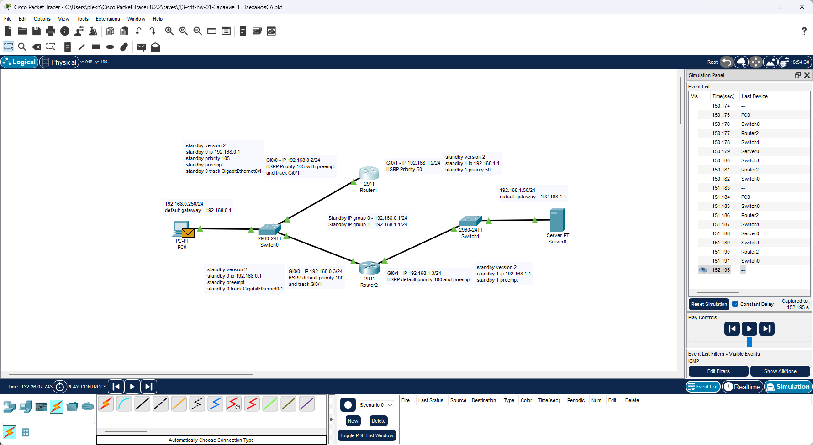
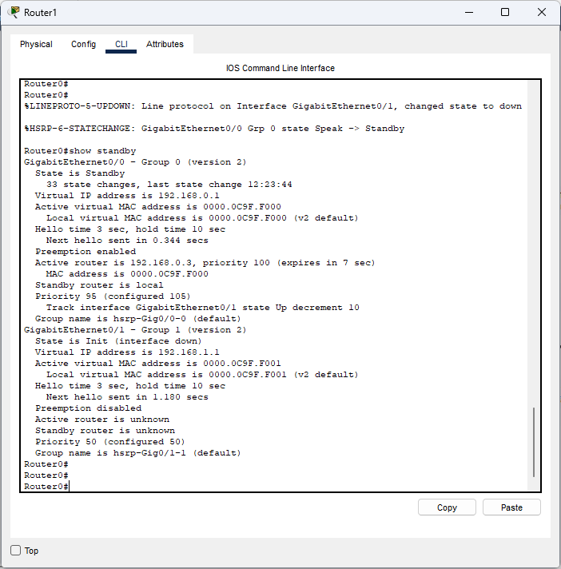
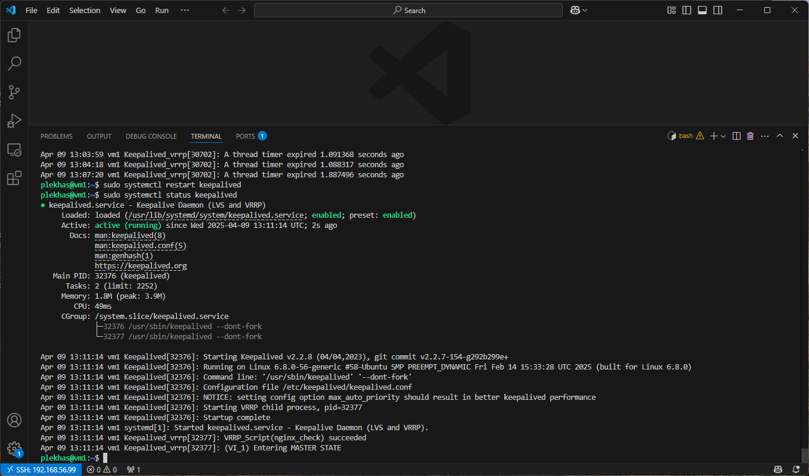
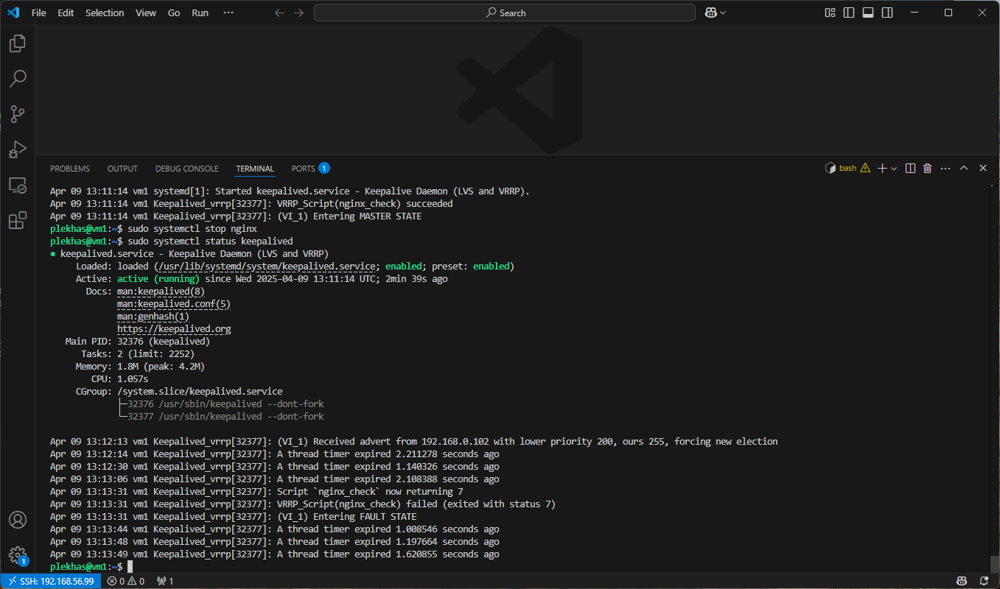
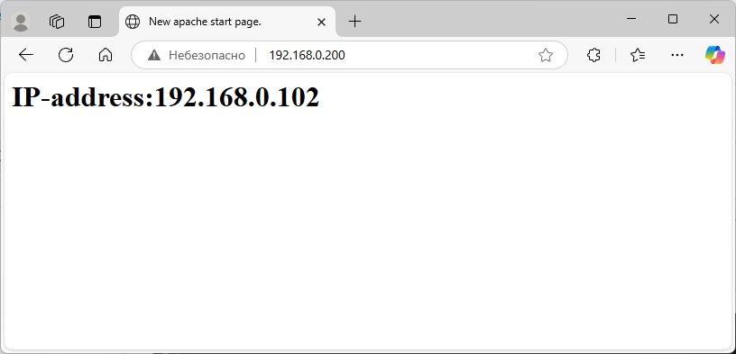
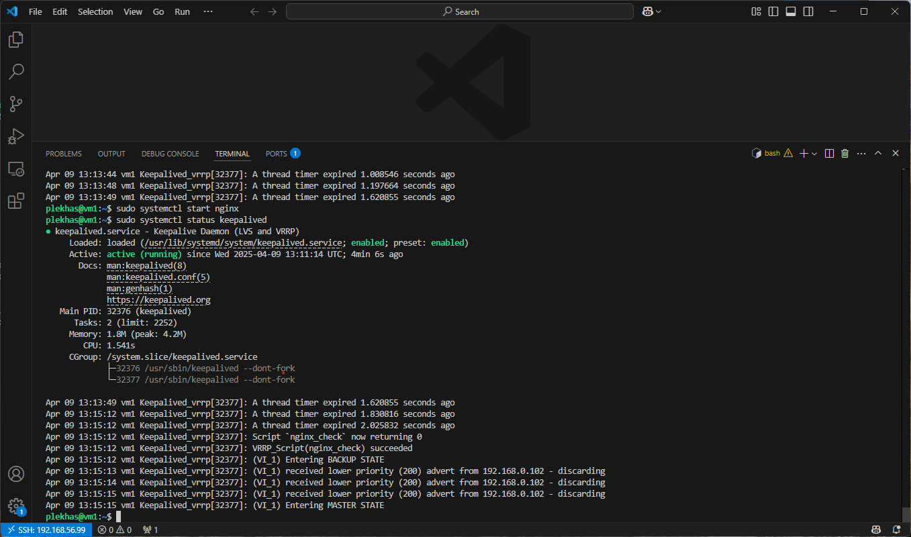
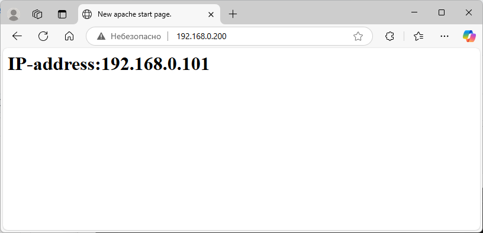

# Домашнее задание к занятию 1 «Disaster recovery и Keepalived» - Плеханов Степан
## Задание 1





## Задание 2

````bash
global_defs {
    enable_script_security
}

vrrp_script nginx_check {
    script /etc/keepalived/nginx_check.sh
    interval 3
    user plekhas
}

vrrp_instance VI_1 {
        state MASTER
        interface enp0s8
        virtual_router_id 200
        priority 255
        advert_int 1

        virtual_ipaddress {
              192.168.0.200/24
        }
        track_script {
              nginx_check
        }

}
````

````bash
#!/bin/bash
if [ ! -e /var/www/html/index.html ]
then
        exit 1
fi

curl -Is http://localhost
````








